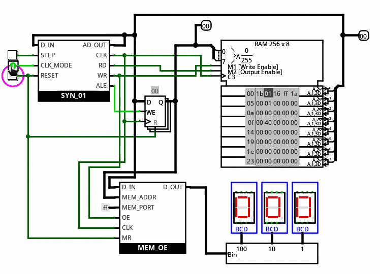
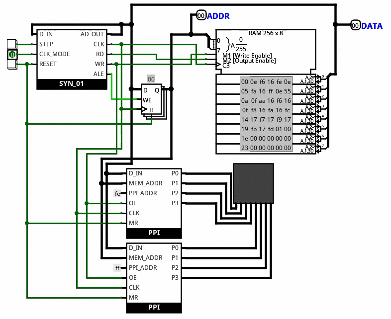

# SYN_01
SYN_01 represents my first attempt at designing a processor from discrete logical components in [logisim-evolution](https://github.com/reds-heig/logisim-evolution). The Processor is highly limited in its capabilities, but was a good workout in terms of learning how a very simple processor might be implemented.

## In Action

  
    
A simple counter program in action

  </img>

  
    
A program that generates a checker board pattern

  </img>

## Limitations
* The first limitation is in the sense that the processor can access only 256 bytes of memory, and can be considered as an 8bit processor with respect to both memory and processing.
* The Instruction set is incomplete and fairly limited in number and usage. There arent a lot of programs that can be written but there are examples in the programs directory of a few possible programs.
* Since the project uses a lot of modules, simulation becomes very very slow.
* The assembler is really really bad.

## Future of this project
This project in different aspects contains a lot of caveats that I would like to fix but it is very cumbersome to go ahead and do actual rewiring of different components to make updates to the processor. Then there is the question of the simulation speed which is highly limited in this format. The solution to these problems that I found is that [logisim-evolution](https://github.com/reds-heig/logisim-evolution) has the capability of loading external jar files as modules which can contain components, the logic of which can be written in java. The problem with that is that there is a dearth of documentation for actually going about and writing these extensions, but I did go through the original source code and figured out how to do exactly that.

So in short I would be working on the SYN processor project and try improving it but not in this repository. I would be working on the [logisim-evolution](https://github.com/reds-heig/logisim-evolution) extension package that will contain this processor as well as other processors that I might design as upgrades in the future. This project is merely for archival and reference purposes. This project also might serve as a starting point for understanding the simplest most possible architechture before designing a more complex one.
